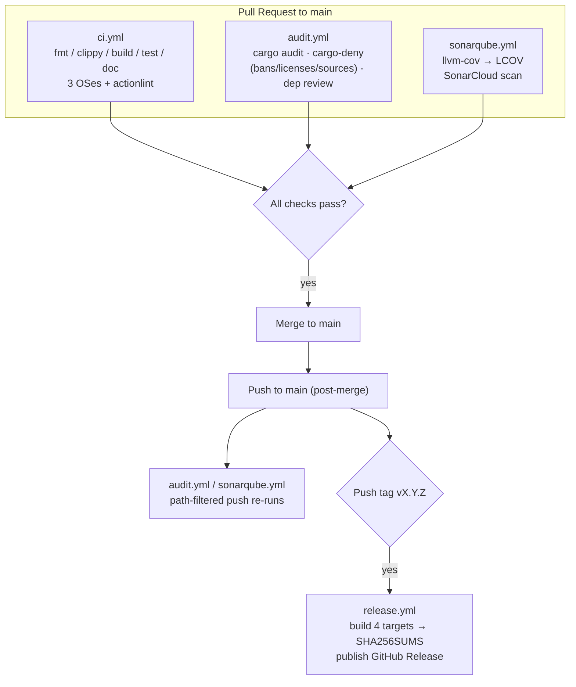

# GitHub Actions — Workflow Guide

A practical, deep-dive reference to the continuous integration and release
automation that powers `gutenberg_parser`.

- **Scope:** every workflow under `.github/workflows/`, the configuration that
  drives them (`Cargo.toml`, `deny.toml`, `sonar-project.properties`), and the
  GitHub settings they depend on (branch protection, secrets).
- **Audience:** maintainers and contributors who need to understand, operate,
  debug, or extend the CI/CD pipeline.
- **Status:** reflects the workflows as of August 2026.

---

## 1. Overview

The pipeline is split across four focused workflows. They cover two lifecycles:

- **Merge gate (pull requests):** every PR to `main` is vetted by CI
  (compile/lint/test on 3 OSes), dependency security, and SonarCloud.
- **Release path (post-merge):** after you push a `v*` tag, cross-platform
  binaries and checksums are published to a GitHub Release.



## 2. Quick Reference

| File | Purpose | Triggers | Path filters | Cancels in-flight? | Secrets |
| :--- | :--- | :--- | :--- | :--- | :--- |
| `ci.yml` | Quality gate: fmt, clippy, unused deps, build, test, docs, workflow lint | `push` + `pull_request` on `main` | no (job-level via `paths-filter`) | yes | none |
| `audit.yml` | Dependency security: RustSec advisories, cargo-deny (bans/licenses/sources), dependency review | `schedule` (Mon 03:00 UTC), `workflow_dispatch`, `push` + `pull_request` | `Cargo.toml`, `Cargo.lock`, `deny.toml`, workflow file | yes | none |
| `sonarqube.yml` | Static analysis + line coverage on SonarCloud | `push` + `pull_request` on `main` | `src/**`, `*.lock`, `*.toml`, workflow file | yes | `SONAR_TOKEN` |
| `release.yml` | Cross-platform binaries, SHA256 checksums, GitHub Release | tag push `v*`, `workflow_dispatch` | no | no | none (uses `GITHUB_TOKEN`) |

> **Concurrency:** `ci`, `audit`, and `sonar` group by `github.ref` and cancel
> stale runs. `release` runs without concurrency settings — each tag is a
> distinct, short-lived build.

---

## 3. ci.yml — Continuous Integration (quality gate)

File: `.github/workflows/ci.yml` · Workflow name: **CI**

### 3.1 Triggers

- `pull_request` to `main` (`opened`, `synchronize`, `reopened`)
- `push` to `main`

There are **no workflow-level path filters**: the workflow always runs. Cost is
kept low by a job-level filter (see below).

### 3.2 Jobs

| Job | Runner | `needs` | Condition | Actions |
| :--- | :--- | :--- | :--- | :--- |
| `changes` | `ubuntu-latest` | — | always | `dorny/paths-filter@v3` detects whether Rust code changed |
| `quality-gate` | `ubuntu-latest`, `macos-latest`, `windows-latest` | `changes` | only if Rust paths changed | fmt, clippy, machete, release build, tests, docs |
| `lint-workflows` | `ubuntu-latest` | — | always | `raven-actions/actionlint@v2` lints all workflow YAML |

### 3.3 The `changes` filter

`changes` evaluates a `rust` filter against the diff. It matches:

```yaml
rust:
  - 'src/**'
  - 'Cargo.toml'
  - 'Cargo.lock'
  - '.rustfmt.toml'
  - 'rust-toolchain.toml'
  - 'rust-toolchain'
  - '.github/workflows/ci.yml'
```

Its output (`needs.changes.outputs.rust`) guards the expensive matrix:

```yaml
needs: changes
if: needs.changes.outputs.rust == 'true'
```

**Behavior:** a PR that only touches `README.md` skips the 3-OS matrix entirely
and merges fast; a PR touching `src/` or manifests runs the full gate. If you
ever see "no checks ran", this filter is the reason.

### 3.4 What the matrix checks

For each OS (fail-fast disabled so one OS can't kill the others):

1. `cargo fmt --all -- --check` — formatting enforced via `.rustfmt.toml`
   (`max_width = 120`).
2. `cargo clippy --all-targets --all-features --locked -- -D warnings` — all
   warnings are errors.
3. `cargo machete` (installed via `taiki-e/install-action`) — fails on unused
   dependencies.
4. `cargo build --release --locked` — release build must succeed with the lock
   file unchanged.
5. `cargo test --all-features --locked` — currently 0 tests; this is the hook
   point when unit tests are added.
6. `cargo doc --no-deps --all-features` — docs must build.

`Swatinem/rust-cache@v2` (key `ci-<os>`) keeps cross-OS caches distinct.

### 3.5 `lint-workflows`

Runs `raven-actions/actionlint@v2` (includes ShellCheck) over every workflow.
This is the check that catches YAML/structure mistakes *and* shell problems in
`run:` scripts before they reach production.

---

## 4. audit.yml — Dependency Security

File: `.github/workflows/audit.yml` · Workflow name: **Dependency Audit**

### 4.1 Triggers

- `schedule`: weekly, **Mon 03:00 UTC**
- `workflow_dispatch`: manual
- `push` to `main` and `pull_request`, but only when one of these changed:
  `Cargo.toml`, `Cargo.lock`, `deny.toml`, or `audit.yml` itself

### 4.2 Jobs — three independent layers

| Job | Purpose | Tool |
| :--- | :--- | :--- |
| `cargo-audit` | Known CVEs in the dependency tree (RustSec Advisory DB) | `actions-rust-lang/audit@v1` |
| `cargo-deny` (×3) | Policy checks via `deny.toml` | `EmbarkStudios/cargo-deny-action@v2` |
| `dependency-review` | Flag risky **new/changed** dependencies on PRs | `actions/dependency-review-action@v4` |

- `cargo-deny` is a matrix of three checks: `bans`, `licenses`, `sources`
  (fail-fast disabled, names `cargo-deny (bans)`, `cargo-deny (licenses)`,
  `cargo-deny (sources)`).
- `dependency-review` only runs on `pull_request` events (`if:`) and needs
  `pull-requests: write` to comment on PRs.

### 4.3 How `deny.toml` drives policy

| Section | Policy for `gutenberg_parser` |
| :--- | :--- |
| `[bans]` | Multiple versions of a crate → warn; duplicate-blocklist is empty |
| `[licenses]` | Allow list: MIT, Apache-2.0, Apache-2.0 WITH LLVM-exception, BSD-3-Clause, Unlicense, Unicode-3.0, 0BSD, Zlib, ISC, CDLA-Permissive-2.0; confidence ≥ 0.8 |
| `[sources]` | crates.io registry only; any unknown registry/Git source is denied |

Two deliberate choices, both documented in `deny.toml`:

- **No `[advisories]` section.** Vulnerability scanning is delegated to
  `cargo audit` (Job `cargo-audit`). `cargo-deny ≥ 0.18` also removed
  deprecated advisory keys — do **not** re-add them, they break the schema.
- The license allow list exists so the `licenses` check passes cross-platform.
  `Cargo.toml` declares `license = "MIT"` and the repo ships `LICENSE`;
  all three must stay in sync.

---

## 5. sonarqube.yml — SonarCloud Analysis & Coverage

File: `.github/workflows/sonarqube.yml` · Workflow name: **SonarCloud analysis**

### 5.1 Triggers

`push` to `main` and `pull_request`, restricted to `src/**`, `**/*.lock`,
`**/*.toml`, and the workflow file itself. A README-only PR skips SonarCloud
entirely.

### 5.2 Pipeline (single `sonarqube` job)

1. `actions/checkout@v4` with **`fetch-depth: 0`** — full history is required
   for SonarCloud's new-code tracking and PR decoration.
2. `dtolnay/rust-toolchain@stable` with `clippy` **and `llvm-tools-preview`**
   (the latter is required by cargo-llvm-cov).
3. `Swatinem/rust-cache@v2` (key `sonar`).
4. `taiki-e/install-action@cargo-llvm-cov`.
5. **Generate coverage:**
   `cargo llvm-cov --all-features --tests --lcov --output-path lcov.info`
   — LLVM source-based line coverage exported as LCOV.
6. `SonarSource/sonarqube-scan-action@v6` with `SONAR_TOKEN`.

### 5.3 Configuration (`sonar-project.properties`)

```properties
sonar.projectKey=testingdb_gutenberg_parser
sonar.organization=testingdb
sonar.sources=src
sonar.host.url=https://sonarcloud.io
sonar.rust.lcov.reportPaths=lcov.info
```

### 5.4 Gotcha: LCOV property (read this before touching coverage)

There are **two different** coverage properties and they are not interchangeable:

- `sonar.coverageReportPaths` — expects Sonar's **generic XML** format. Feeding
  LCOV here fails with:
  `Error during parsing of the generic coverage report … expected XML format`
  (exit code 3).
- `sonar.rust.lcov.reportPaths` — the property the **Rust analyzer** uses to
  consume **LCOV** files. This is the correct one for `cargo llvm-cov`.

If the scan job ever starts failing with "expected XML format", the workflow is
fine — `sonar-project.properties` was probably changed to the wrong property.

### 5.5 Secrets

- `SONAR_TOKEN` must exist in repository or org secrets. In the GitHub→
  SonarCloud UI the org is `testingdb` and the project key is
  `testingdb_gutenberg_parser`; those must match the `.properties` file.

---

## 6. release.yml — Cross-Platform Release Publishing

File: `.github/workflows/release.yml` · Workflow name: **Build and Publish Tagged Release**

### 6.1 Triggers & authorization guard

- Tag push matching `v*` (e.g. `v1.0.6`).
- `workflow_dispatch` with a required `tag_name` input (manual release).

The whole pipeline is gated on the **build** job:

```yaml
if: >-
  (github.event_name == 'push' && startsWith(github.ref, 'refs/tags/')) ||
  (github.event_name == 'workflow_dispatch' && github.actor == github.repository_owner)
```

Manual runs are allowed **only for the repo owner**. Because `checksum` and
`release` both declare `needs: build`, a skipped `build` automatically skips
them — a single guard protects the entire chain.

### 6.2 Job dependency graph

```
build (matrix × 4)  ──►  checksum (SHA256SUMS.txt)  ──►  release (GitHub Release)
```

### 6.3 The build matrix

| OS runner | Target triple | Artifact |
| :--- | :--- | :--- |
| `ubuntu-latest` | `x86_64-unknown-linux-gnu` | `.tar.gz` |
| `macos-15-intel` | `x86_64-apple-darwin` | `.tar.gz` |
| `macos-latest` | `aarch64-apple-darwin` | `.tar.gz` |
| `windows-latest` | `x86_64-pc-windows-msvc` | `.zip` |

Notes:

- `macos-15-intel` is the **Intel** macOS runner; `macos-latest` is arm64.
  The two labels must not be swapped or you'd build arm64 twice and ship no
  Intel macOS binary.
- `fail-fast: false` so one platform failing doesn't cancel the others.
- Each matrix leg compiles with
  `cargo build --release --locked --target <triple>`; the toolchain installs
  the matching `targets:` entry and the cache key is `release-<target>`.

### 6.4 Tag ↔ version consistency

On **tag pushes only** (`if: github.event_name == 'push'`), the workflow
verifies the tag matches `Cargo.toml`:

```bash
version="$(sed -n 's/^version = "\(.*\)"/\1/p' Cargo.toml | head -n 1)"
if [ "v${version}" = "${tag}" ]; then ... else exit 1; fi
```

A tag `v1.0.6` with `Cargo.toml` at `1.0.5` fails the build. This keeps release
metadata honest and is why a version bump must land in `Cargo.toml` **before**
tagging.

### 6.5 Packaging

- Non-Windows: `tar -czf gutenberg_parser-<target>.tar.gz -C target/.../release gutenberg_parser`
- Windows: `powershell Compress-Archive` wraps `gutenberg_parser.exe`.
- Every archive is uploaded via `actions/upload-artifact@v4` under
  `gutenberg_parser-<target>`.

### 6.6 Checksums & the release

- `checksum` job downloads **all** archives (`merge-multiple: true`) and writes
  `SHA256SUMS.txt` via `sha256sum ./*`.
- `release` job re-downloads everything, resolves the tag
  (`inputs.tag_name` for manual runs, `github.ref_name` for tag pushes), and
  creates the release with `softprops/action-gh-release@v2`:

  ```
  gutenberg_parser-x86_64-unknown-linux-gnu.tar.gz
  gutenberg_parser-x86_64-apple-darwin.tar.gz
  gutenberg_parser-aarch64-apple-darwin.tar.gz
  gutenberg_parser-x86_64-pc-windows-msvc.zip
  SHA256SUMS.txt
  ```

- The release body lists the commit SHA and the expected assets. If you change
  the matrix, update the hard-coded asset list in the `body:` block.

---

## 7. Branch Protection Setup (required checks)

Configure in **Settings → Branches → Add/Edit rule for `main`** →
"Require status checks to pass before merging". Add these exact check names:

**From `ci.yml`**

- `Detect Changed Paths`
- `fmt / clippy / build / test (ubuntu-latest)`
- `fmt / clippy / build / test (macos-latest)`
- `fmt / clippy / build / test (windows-latest)`
- `Validate Workflow YAML`

**From `audit.yml`**

- `Security advisories (cargo audit)`
- `cargo-deny (bans)`
- `cargo-deny (licenses)`
- `cargo-deny (sources)`
- `Dependency Review`

**From `sonarqube.yml`**

- `sonarqube`

> **Matrix legs** are reported individually — each `(os)` variant is its own
> check and must be added separately.
>
> **Skipped checks:** `quality-gate` and the audit/sonar checks are
> path-filtered. When a PR doesn't touch their paths, the check reports
> "skipped". GitHub treats skipped required checks from a *run* workflow as
> passed; to make statuses always explicit, also require `Detect Changed Paths`.
>
> **Stale entries:** if a typo'd check name (e.g. `soanrqube`) was ever saved
> here, remove it via the edit UI — those names exist only in the rule, never
> in the repo.
>
> Optionally enable **SonarCloud's own "Quality Gate"** check (via SonarCloud,
> not here) for coverage/duplication gating.

---

## 8. Secrets & Pinned Actions

### 8.1 Secrets

| Secret | Used by | Notes |
| :--- | :--- | :--- |
| `SONAR_TOKEN` | `sonarqube.yml` | SonarCloud user token; org `testingdb`, project `testingdb_gutenberg_parser` |
| `GITHUB_TOKEN` | `release.yml` | Automatic; no setup needed |

No other secrets exist. `CARGO_REGISTRY_TOKEN` is intentionally absent (the
crate is not published to crates.io).

### 8.2 Third-party actions (all version-pinned)

| Action | Version |
| :--- | :--- |
| `actions/checkout` | `v4` |
| `dtolnay/rust-toolchain` | `@stable` (with `components` / `targets`) |
| `Swatinem/rust-cache` | `v2` |
| `dorny/paths-filter` | `v3` |
| `taiki-e/install-action` | (latest via action) |
| `raven-actions/actionlint` | `v2` (bundles ShellCheck) |
| `actions-rust-lang/audit` | `v1` |
| `EmbarkStudios/cargo-deny-action` | `v2` |
| `actions/dependency-review-action` | `v4` |
| `SonarSource/sonarqube-scan-action` | `v6` |
| `actions/upload-artifact` / `download-artifact` | `v4` |
| `softprops/action-gh-release` | `v2` |

Keep these coordinated — Dependabot (configured at the GitHub level) will
propose bumps, and every bump must keep `actionlint` green.

---

## 9. Local Verification

Before pushing workflow changes, lint them with the same tool CI uses:

```bash
actionlint -shellcheck=shellcheck .github/workflows/*.yml
```

- Zero output = all four workflows (YAML structure + shell `run:` scripts)
  are clean.
- Install on Alpine: `apk add actionlint shellcheck` (or use the GitHub Action
  on a branch).

Related one-off checks run locally during development:

```bash
cargo fmt --all -- --check
cargo clippy --all-targets --all-features --locked -- -D warnings
cargo build --release --locked
```

> Local caveat: `cargo machete` and `cargo install` tools can fail to build on
> Alpine/musl (jemalloc). CI installs prebuilt binaries on Ubuntu, so the CI
> step is unaffected.

---

## 10. Troubleshooting Runbook

| Symptom | Cause | Fix |
| :--- | :--- | :--- |
| "Error during parsing of the generic coverage report… expected XML format" (exit 3) | `sonar-project.properties` uses `sonar.coverageReportPaths` (XML-only) for LCOV | Use `sonar.rust.lcov.reportPaths=lcov.info` (§5.4) |
| Scan runs but shows 0% coverage | No tests run during `cargo llvm-cov` (0 unit tests) or wrong property | Add tests; keep LCOV property correct |
| PR shows no checks / "Expected — waiting" | Path-filtered workflow never ran for those paths | Add `Detect Changed Paths` to required checks (§7) |
| ShellCheck: `SC2193` constant comparison | `${{ }}` expansion + `[ ... = "${{ … }}" ]` looks constant | Assign the value to a variable first (§6.4) |
| ShellCheck: `SC2035` | Unquoted `*` glob in `sha256sum` | Use `sha256sum ./*` (§6.6) |
| "Tag vX.Y.Z does not match Cargo.toml version" | Tag and manifest out of sync | Bump `Cargo.toml` first; tag `v<exact version>` |
| `cargo machete` job fails | Unused dependency introduced | Remove the dependency, or update the Cargo.lock |
| Dependency review blocks PR | New dep is high-risk / no allowlisted license | Verify the dep; add license to `deny.toml` if appropriate |
| Workflow changes rejected by actionlint | YAML/shell issue | Run the local check from §9 |

---

## 11. Maintenance Guide

**Add an OS/architecture to releases**

1. Add an `os`/`target` entry to the `build` matrix in `release.yml`.
2. Add the archive to the hard-coded asset list in the `release` job body.
3. Re-run `actionlint -shellcheck=shellcheck`.

**Add a cargo-deny check**

1. Add the check name to the `checks` matrix in `audit.yml`.
2. Add the matching section to `deny.toml`.

**Reschedule the weekly audit** — change the cron in `audit.yml` (UTC):
`0 3 * * 1` = Mondays 03:00 UTC.

**Make coverage meaningful** — add unit/integration tests. They are already
wired in: `quality-gate` runs `cargo test`, and `sonarqube.yml` runs
`cargo llvm-cov`. More tests → real LCOV data → real SonarCloud coverage.

---

## Appendix — Glossary

| Term | Meaning |
| :--- | :--- |
| LCOV | Line-coverage interchange format consumed by SonarCloud's Rust analyzer |
| Conventional Commit | `type(scope): summary` format (`feat`, `fix`, `chore`, …; `!` = breaking) |
| Path filter | Restricts a workflow/job to run only when listed files change |
| `GITHUB_TOKEN` | Auto-issued, scoped token; can't trigger downstream workflow runs on pushes it makes |
